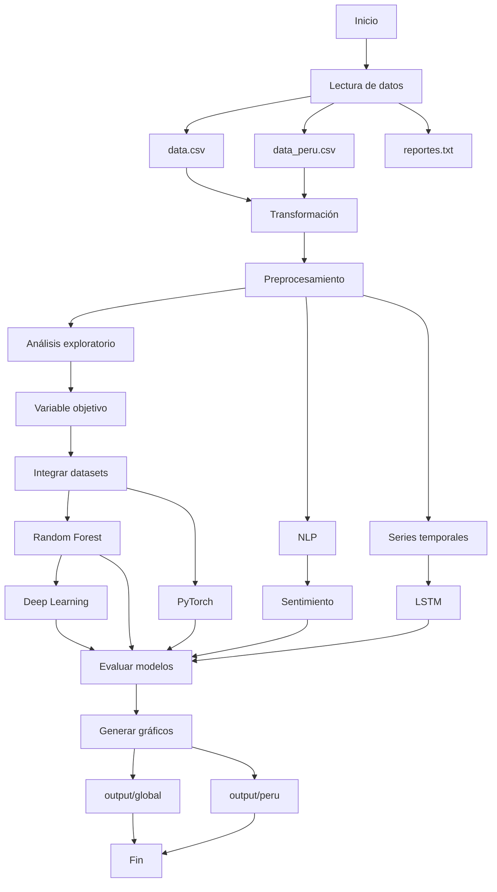

# Diagrama de Flujo General

```mermaid
flowchart TD
    A[Inicio] --> B[Lectura de datos]
    B --> C[data.csv]
    B --> D[data_peru.csv]
    B --> E[reportes.txt]
    C --> F[Transformación]
    D --> F
    F --> G[Preprocesamiento]
    G --> H[Análisis exploratorio]
    H --> I[Variable objetivo]
    I --> J[Integrar datasets]
    J --> K[Random Forest]
    J --> L[PyTorch]
    G --> M[NLP]
    M --> N[Sentimiento]
    G --> O[Series temporales]
    O --> P[LSTM]
    K --> Q[Deep Learning]
    K --> R[Evaluar modelos]
    L --> R
    P --> R
    Q --> R
    N --> R
    R --> S[Generar gráficos]
    S --> T[output/global]
    S --> U[output/peru]
    T --> V[Fin]
    U --> V
```
